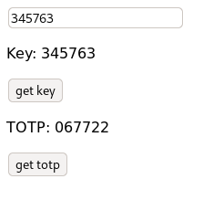

# Tauri Liboath Example

An app demonstrating a [yew](https://yew.rs) frontend using [tauri](https://tauri.studio) to access a shared library ([liboath](https://github.com/littlebenlittle/rust-liboath)).

